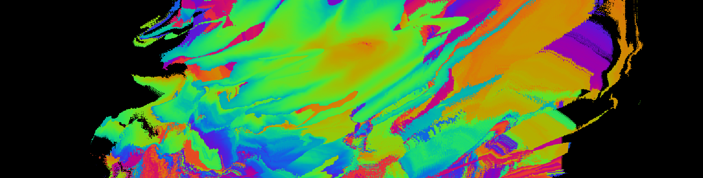

# Código creativo 2. Programación estructurada en el diseño

Al finalizar el curso el alumno: Aplicará conocimientos de programación estructurada en Processing para realizar ejercicios básicos de diseño y lenguaje visual 2D.   
Reconocer el contexto de la programación (no) creativa y de la generación de imágenes en relación a herramientas de inteligencia artificial. 

## Sesiones

- [ ] 22.01.22 - [Sesión 01 - Introducción a Processing](docs/s01.md) 

## Recursos 

- [Processing](https://processing.org/)
- [ChatGPT](https://chat.openai.com/)
- [Sistema de Cordenadas](https://processing.org/tutorials/coordinatesystemandshapes)

## Recursos adicionales

- [Collage + code de Ana Carreras](https://www.annacarreras.com/collage-generatiu/)
- [Daily art de Saskia Freeke](https://sasj.nl/portfolio/)
- [Cosmic Poems de Mark Webster](https://mwebster.online/dev/work)

## Criterios de evaluación

- Realización de ejercicios parciales sobre lógica condicional (30%)
- Realización de ejercicios parciales sobre loops y funciones (30%)
- Desarrollo de 5 diseños que puedan evidenciar el uso de: condicionales, bucles, funciones aleatorias para el diseño y lenguaje visual 2D (40%) 

## Referencias

- Codina, Ll. (2023) [Cómo utilizar ChatGPT en el aula con perspectiva ética y pensamiento crítico: una proposición para docentes y educadores](https://www.lluiscodina.com/chatgpt-educadores/)
- Choi, T. (2017) [Hello World](http://avant.org/project/hello-world/)
- Choi, T. (2017) [Zero and One](http://avant.org/project/zero-one/)
- Felguérez, M y Sasson, M. (1983) La Máquina Estética. Universidad Nacional Autónoma de México. 
- Goldsmith, K. (2011) Uncreative Writing: Managing Language in the Digital Age. Columbia University Press.
- Reas, C. and Fry, B. (2014) [Processing: A Programming Handbook for Visual Designers and Artists. The MIT Press](https://drive.google.com/file/d/1jFECuOzu8t2vzE9QmStZotYWfDqD9yYk/view?usp=share_link).
- Stieg, C. (2023) [ChatGPT vs. Me: Can an AI Chatbot Build a Program From Scratch Better Than a Human?](https://www.codecademy.com/resources/blog/chatgpt-vs-human-developer-coding-project/)
